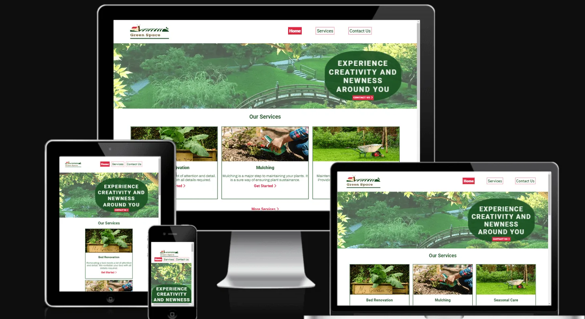

# GREEN SPACE - *Garden Updates and Services*

[View code here](https://github.com/belovedpearl/Green_Space-PP1)

[View site responsiveness here](https://ui.dev/amiresponsive?url=%20https://belovedpearl.github.io/Green_Space-PP1/)

---

**Table of Contents:**
---
---
 * [Project Description](#project-description)
    * [Site Owners Goal](#site-owners-goal)
    * [Users Goal](#users-goal)
    * [Target Audience](#target-audience)
   
* [WireFrames](#wireframes)
    * [Initial Wireframes](#initial-wireframes)
       * [Wireframe 1](#wireframe-1-the-index-page)
       * [Wireframe 2](#wireframe-2-services-page)
       * [Wireframe 3](#wireframe-3-contact-page)

    * [Device Wireframes](#device-wireframe)
       * [Wireframe 4](#wireframe-4-desktop-and-laptop)
       * [Wireframe 5](#wireframe-5-tablets-and-mobile)
* [Features](#features)
    * [Header](#header)
    * [Blog](#blog)
    * [Footer](#footer)
    * [Newsletter Subscription](#newsletter-subscription)
    * [Social Media Links](#social-media-links)
    * [Checkboxes](#checkboxes)
    * [Call Function](#call-function)
    * [Submit form](#submit-form)

* [Future features](#future-features)
* [Design Choices](#design-choices)
   * [Font](#font)
   * [Color Schemes](#colour-scheme)

* [Accessibility](#accessibility)

* [Technology, Frameworks and Programs](#technology-frameworks-and-programs)
     * [languages](#languages)
     * [Frameworks and Programs](#frameworks-and-programs)

* [Bugs](#bugs)
     * [Fixed Bugs](#fixed-bugs)
     * [Unfixed Bugs](#unfixed-bugs)

* [Deployment](#deployment)
* [Tools](#tools)
* [Testing](#testing)
     * [Validator Testing](#validator-testing)
         * [HTML](#html)
         * [CSS](#css)
     * [Lighthouse Performance](#lighthouse-performance)
     * [Functional Testing](#functional-testing)
* [Credit](#credits)
* [Acknowledgement](#acknowledgement)
 

---

 ## Project Description

---

 Green Space website is designed to provide a platform where garden lovers can connect with different gardening service providers based on gardening standards. It also aims to update its users on the latest news and practices involved in gardening. In today's world, there are needs in relation to gardening and less time to go in search for one. The availability of quick and prompt service source will promote gardening practice and overall improved gardening practices. Hence, the platform seeks to be a source where relevant and quality gardening services can be accessed.

 It also seeks to create a community of gardening lovers promoting right practices and keeping its members up to date with gardening updates and news that relates to standard practices.

---

## Site Owners Goal

---

   * To enable first time users understand what the site is about from its outlook.
   * To emphasize *green nature* and the importance of it.
   * To promote nature to its users.
   * To showcase the services the users can get through the platform.
   * To provide option for users to get quick quote for services required from random provider before finally settling for one.
   * To keep its users up to date with relevant updates in gardening practices.
   * To promote people's understanding of gardening through newsletter sent regularly. 
   * To build a community of gardening lovers promoting right practice

---

  ## Users Goal

---

* To easily navigate and understand the website.
* To have access to all services that can be obtained through the platform.
* To get updates about gardening by been able to register for newsletters.
* To easily contact the website providers when the need arises.
* Identify and see new blogs on the site.
* To connect easily with the service providers across different platform.

---

## Target Audience

---

Target audience for this project are **garden lovers** who understand the need to keep plant around them **green** all year **round** by using the right hands for services and staying connected to latest updates to garden. 

It also targets people who like to know more about gardening.

---

## Wireframes

---

All wireframes are made with Balsamiq

### Initial Wireframes

The main page presents some of the basic service its users can have access to with others stated on the services page and it also highlights the services provided, an update section, contact section, location map and social media links. For ease of access, the main page has links that connects with the contact page to allow the user access the providers easily.

##### Wireframe 1: The landing page

 

##### Wireframe 2: Services Page

##### Wireframe 3: Contact Page

---

### Device Wireframe

Presention of information on the site will be in the following ways;

##### Wireframe 4: Desktop and Laptop

##### Wireframe 5: Tablets and Mobile

---

## Features

---

The website is made up of 4 pages;

  * Home Page

  The homepage displays a slides of picture that shows a range of green environment aimed at educating its users about the beauty of nature when we keep our garden green. It also consist of an overlayed caption that further empasizes the importance of gardening and a link for contact to use the service.

  
 

  It highlights a list of some services its users can access with a link to access more services on the service page 
  
   
 
   The homepage also contains the blog section which holds garden updates where users can get the current trends in garden practice.
  
  Each service section is made to link the service providers through which the user can access and the services required. 

  
    

  * Services Page

   This further highlights more services users can have access to from the page and with a link to contact the service providers.

   
 

  * Contact Page

   As a way to build  interaction and promote communication, users can contact the providers and feedback on the requested service will be provided. To contact the providers, users can either use the link or go through the navigation links provided.

   
   
   * Response Page on Submission of Enquiry

   As a way to improve users experience, on submitting the enquiry form, users get notified with a message assuring them that they will be contacted with details of their requested service.

   

---

#### Header

Across all pages, the header features the website's name and logo along with the navigation links to connect other pages. The header displays uniformly across all the pages.

---

 #### Blog

 

 
As part of the aim of this site, this is a section aimed for garden updates where users can get the current trends in garden practice therby promoting healthy practice among garden lovers. With an external link, it reference the page update and keep user connected to the main page.

---

 #### Footer

The footer features 3 sections;
   * A section to register for newsletters on gardening.
   * Social media links to connect and build the community.
   * Copyright information.

---

### Newsletter Subscription

This allows intrested users to subscribe to the site's monthly newsletter. It requires an email address before a submission can be done.

---

### Social Media Links

This features links to stay connected with the service  across different social platforms.

---

### Checkboxes

Users can specify service required on the form by ticking one or more of the checkbox available.
 
 
---

### Call function

To aid prompt decision making, intrested users can call to contact the service providers without having to wait more minutes to decide.

---

### Submit form

With a click on a button, user can submit their request.

---
 
## Future Features

---

 * I will like to add a response page after users submit their emails for newsletter subscription or use javasript to pop up a message that users have been registered for subscription.

 * A notification that "Submitted emails have been recieved and will get newsletters from the time of subscription"

 * A testimonial page where the service providers allow people to register their comments about the platform.

 * A gallery page to promote beauty that gardening bestows on the environment.

 * I will like to include a live chat menu where users can get to sort whatever 
 queries they have.

 * A pop-up message on clicking 'Get Quote' which asks users questions that pertains to the services they require and provides an estimate quote for the required service.

 * On clicking the **Get Started** link, users will be provided a list of relevant service providers for easy contact.

 * A search menu that provide a short way of navigating through the site.

 ---

## Design Choices

---

* The design choice was dictated by my ability to use the knowledge gained from the first module of the course. While presenting challenges, it allowed me to achieve a further growth in understanding of the concepts taught better.

* From the start of the program, I aimed to design a website that covers in detail the concepts taught in the module and more.

### Font

* Roboto
    * Evokes a clean and bold style which prompts its readers wanting to act.
* Archivo
    * I believe it complements and blends with Roboto font to give a meaning outlook to the design.

### Colour Scheme

   
   In line with the motive of the website, I have selected a shade of green **(Hex Value = #184E20)** and **White** to complement the green nature attribute that the site promotes.
   Using [color contrast checker](https://dequeuniversity.com/) have checked the contrast of both colors use as foreground and background. Contrast result gave the following;

   |Foreground | Background | Contrast Ratio | Comment |
   |-----------|------------|----------------|---------|
   | #184E20   |  White     | 9.76 : 1       |  Pass   |
   | White     |  #184E20   | 9.76 : 1       |  Pass   |

   
   I have also used **RGB(230,32,65)** as an **accent** color to especially in places where the users attention is needed.

--- 

## Accessibility

---

I have designed the site to be easily accessible  with links thats connect different pages together in order to prompt decision making and to allow for ease of access to information required by its users.

* Services section
   
   This introduces the user to garden standard practices and easy access with links connecting its providers.
* Blog Section

   This section provides users with gardening updates. I have designed all links to open in a new tab.
   
* Contact Us

   This is included to provide easy contact to the providers.

---

## Technology, Frameworks and Programs

---

### Languages
* HTML

* CSS

### Frameworks and Programs

* Balsamiq
    * Used to create wireframes to plan the project

* Github
    * To store written code

* Gitpod
    * The project was put together using Gitpod development environment. From here, I could commit and push all of my changes to Github throughout the project.

---

## Bugs

---

### Fixed Bugs

* Caption Image
    * I discovered the caption image was not properly placed on smaller screen, it was resolved by resizing and viewing it till I got a properly placed caption image.
* Input on contact form not displaying text
    * Using the dev tool, I realised "Color: white" set on the input caused the bug. Removing the color fixed the bug.
*  Images appeared smaller than I intend, changing background size contain to cover fixed it.

* "More Service" link on the index page was too close to the content

    * Adding padding, height and centering text to the div fixed this.

* Footer on service page was not properly presented, looking through the html code, I realised a wrong id was inserted.

* Cursor on submit button was noticed to be in arrow.
   * Changing cursor setting to pointer fixed this.

* Table used in the contact form gave more margin between the cells ob changing the display to block.
   * Changing the table tag to unordered list gave the list equal spacing when changed to block display.
* Textarea was noticed to be smaller than the other inputs on small screen.
   * Adjusting the style on the textarea fixed this.

### Unfixed Bugs

  * I noticed errors in the console which is a result of the embeded google map. It displays appropriately, I feel it is above my current knowledge.

  * Some of my commit statements are not so specific but it was improved upon in subsequent commits.

---

## Deployment

---

### GitHub Pages

* The project was deployed via Github Pages.

The following illustrate the steps I took to deplay my website;

  * Go to the repository for Green Space.
  * Click on the "Settings" tab, locate the "Pages" tab and click it.
  * In the "Build and Deployment" section there is a "Branch Heading". Select to deploy from "main" branch in the dropdown option.
  * Click on save
  * A few minutes later, after refreshing the page, there will automatically be an update containing the "live site link".

The live link can be found [here](https://belovedpearl.github.io/Green_Space-PP1/).

### How to Fork
  
  By forking a repository, you make a copy of a repository without affecting the original repository. You can fork this repository using the following steps.

  * Login to GitHub and locate the [GitHub Repository](https://github.com/belovedpearl/Green_Space-PP1).

  * At the top of the repository just above the "Settings" button on the menu, locate the "Fork" button.

  * Once clicked, you should have a copy of the original repository in your own account.

---

## Tools

---

  *  [Balsamiq Wireframes](https://balsamiq.com/)
  *  [Resizing Images](https://www.reduceimages.com/)
  *  [Reducing Images size](https://tinypng.com/)
  *  [Test for Responsiveness](https://ui.dev/amiresponsive)
  *  [HTML validator](https://validator.w3.org/)
  *  [CSS validation](https://jigsaw.w3.org/)
  *  [Contrast checker](https://dequeuniversity.com/)
  *  [Coolors.co](https://coolors.co/)
  *  [Responsiveness Testing](https://ui.dev/amiresponsive)
   Logo: https://logo-maker.freelogodesign.org/

  * [Font Awesome](https://fontawesome.com/)

  * [Fonts](https://fonts.google.com/)

  * [Font pair](https://fontpair.com/) 

  * [Fonts Awesome](https://www.fontawesome.com/)

  * [Automatic Image Slideshow](https://youtu.be/FrQR7igd9bs)

  * [Fonts](https://fonts.google.com/)

  * [Map](https://www.embedgooglemap.net/ location Chester)

---

## Testing

---

   ### Validator Testing

#### HTML

On all html pages, some issues were found during the check over [W3C Validator check](https://validator.w3.org/#validate_by_input)

   - I was warned that <link rel="preload"> must have "as" attribute.
      > Included "as" in the link tag solved this issue.

   - Error: loading:"Easy" not to be included in div at this time
      > Removing all "loading" attribute fixed this

   - An error in identifying a class as an attribute.
      > Changed the identified id to class attribute
   
   - Label id was identified to be wrongly spelt.
      > Changed the letter to a lower case.

   - Table header was less than column created.
      > Added more "th" to the "tr"

   - Attribute "tel" was not correctly defined.
      > Deleted the spacing contained in the "tel" attribute fixed this.

#### CSS

 * No errors  were found when passed through the official [W3C Validator check](https://validator.w3.org/#validate_by_input)

### Lighthouse Performance

* Home Page
    * Performance = 93
    * Accessibility = 97 
    * Best Practices = 92
    * SEO = 100

* Service Page: 
    * Performance = 96 
    * Accessibility = 95
    * Best Practices = 92
    * SEO = 98

* Contact Page
    * Performance = 94
    * Accessibility = 98 
    * Best Practices = 92
    * SEO = 99

* Response Page: 
    * Performance = 93 
    * Accessibility = 100 
    * Best Practices = 100
    * SEO = 98

* I have tested the website across different device like samsung S20, ipads and laptop.

### Functional Testing

 Functional testing performed for every action within the website. If the behavior is the same as the expected behavior, it will be marked with P for pass, if not F for fail. 

  
| Action (CLICK) | Expected Behavior   | Actual Behavior |
| :---: | :---: | :---: |
| Logo | Load the homepage  | P   |
| HOME menu | Links directly to home page   | P   |
| SERVICE menu | Direct to Service page   | P   |
| CONTACT Us menu | Direct to the contact page  | P   |
| CONTACT US >| Direct to the contact page  | P   |
| Get Started > | Direct to contact page   | P   |
| More Service >| Direct to service page  | P   |
| Blog " >> "| Direct to an external blog page   | P   |
| Phone Number | Pops up a way to call   | P   |
| Submit | Submit details of the form   | P   |
| Facebook icon | Opens up facebook page in another tab  | P   |
| Instagram Icon | Opens up Instagram page in another tab  | P   |
| Twitter Icon | Opens up Twitter page in another tab   | P   |
| From the service page, Get Started > | Direct to the contact page  | P   |
| From Contact page, submit| Direct to a response page   | P   |
| From the contact page, click on the checkbox | Mark the clicked one   | P   |
| From the Response page, click Home| Direct to home page  | P   |

---

## Credits

* ReadMe layout inspiration from other Code Institute students from #peer-code-review forum and https://github.com/kera-cudmore/readme-examples/blob/main/milestone1-readme.md#development

* [ReadMe table presentation](https://github.com/AdamBoley/The-Space-Marine-Legions)

* [ReadMe Table Inspiration](https://github.com/choyoon88/louquiz/edit/main/README.md)

* [Code institute's template](https://github.com/Code-Institute-Org/gitpod-full-template)

* [Learinng more about flex](https://www.freecodecamp.org/news/flexbox-the-ultimate-css-flex-cheatsheet/).

*  [W3Schools](https://www.w3schools.com/), [Stack overflow](https://www.slackoverflow.com/) & [Mdn wed docs](https://developer.mozilla.org/en-US/) - Visited several times to correctly learn how to write and style my code.

* Images: 
Images used are from Isostock, Nikon corporation, png tree and png all

* Content Sources:

As a graduate of Agriculture, I have the understanding about gardening hence I put together all the lines used in illustration with details that I know pertains to each topic.

---

## Acknowledgement

* I will like to thank **My Husband** for his support and understanding during the project, for all encouragement and even getting me on this programme.

* Much love to my **Children** for understanding and encouraging me through this project buildup

* A big thank you to my Mentor, **Sandeep Aggarwal**  for the support and through enlightment he provided during the buildup of this project.

* Thank you to everyone at **Code Institute** for helping us learn.